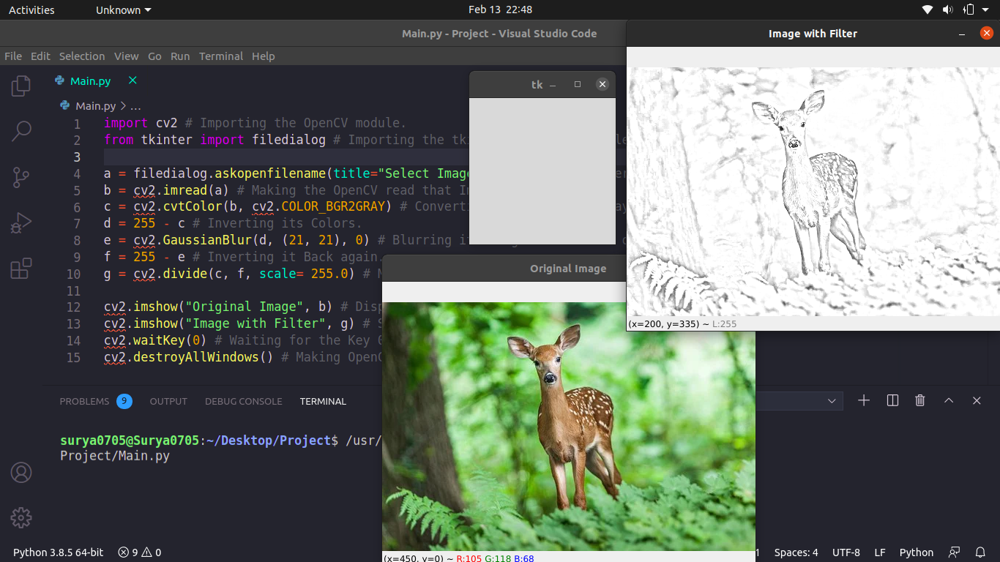

# Awesome_Python_Filter
This is a Python Program that puts up an interesting filter on the Selected Image. It uses OpenCV library for this. To install this Module just type:
```
pip install opencv-python
```
Or if you are in Linux(Ubuntu 20.04 LTS which I am using) then use:
```
pip3 install opencv-python
```
Or install according to your OS. After installation just run the Main.py file and select the Image you want to put on the filter. Below is the Screenshot of My Program:

Hope that you Liked it!
